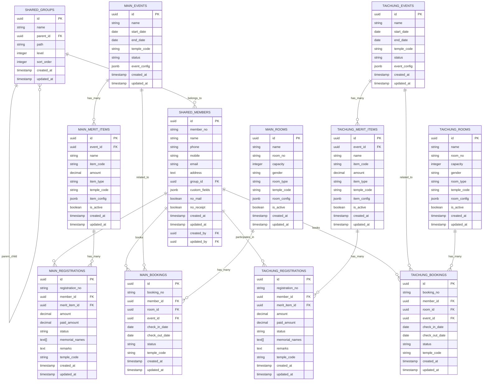
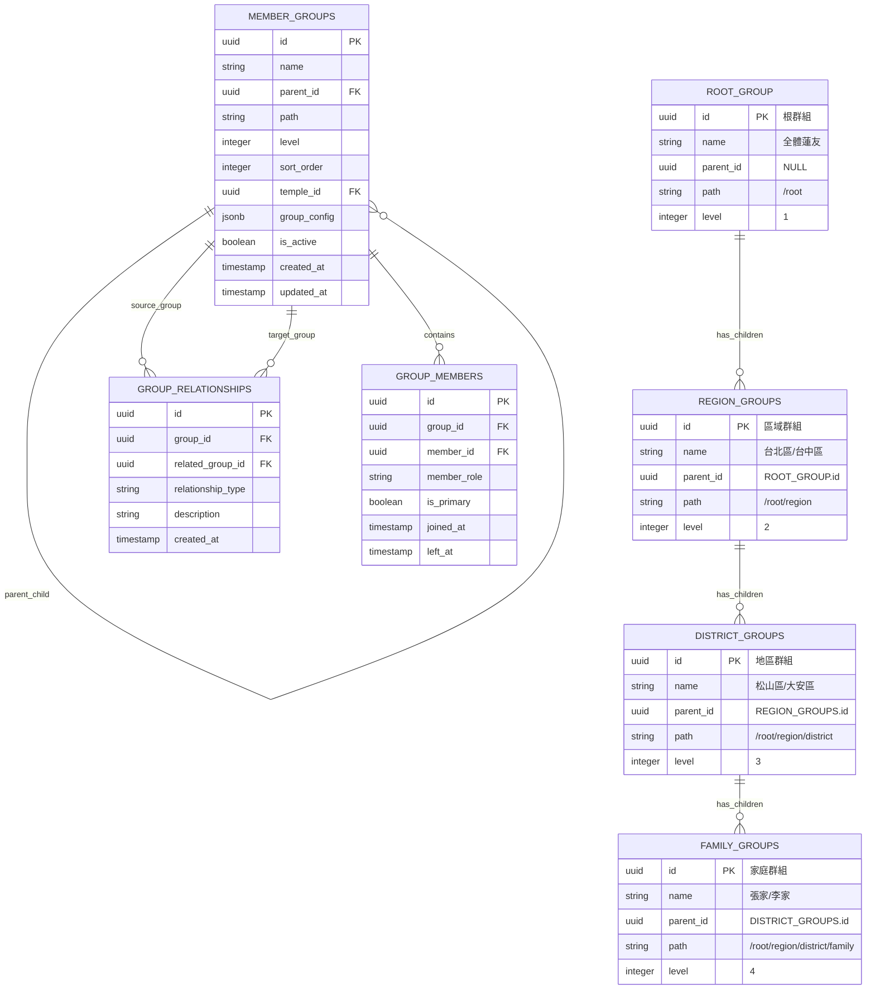
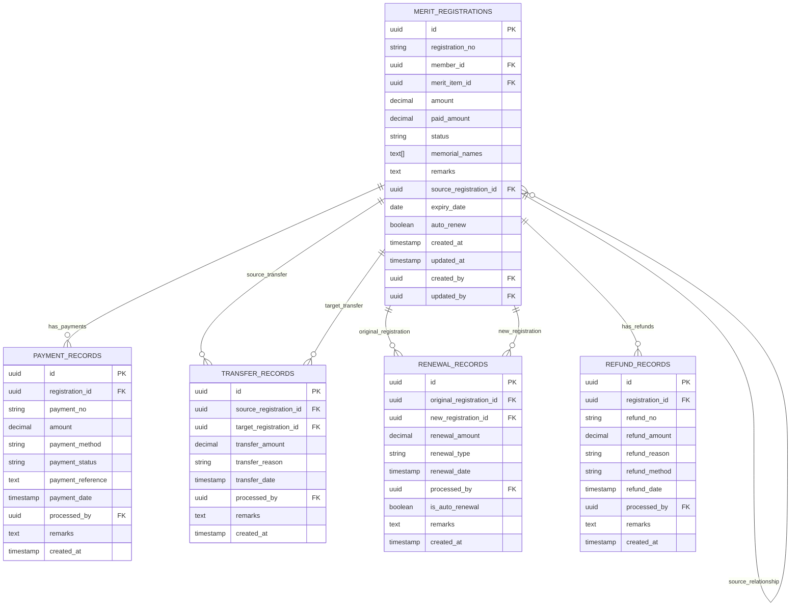
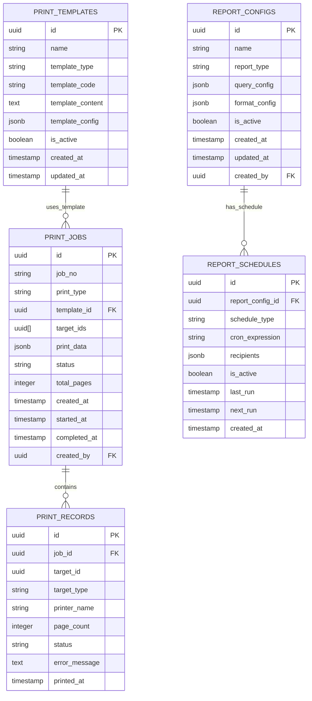

# 功德辦理系統 - 資料庫設計圖

## 文件資訊

- **文件版本**: v1.0
- **建立日期**: 2025 年 07 月 04 日
- **文件類型**: 資料庫設計圖
- **用途**: 展示系統資料庫結構和關聯關係

## 核心資料庫架構

### 1. 整體資料庫結構圖

```mermaid
erDiagram
    %% 寺院和使用者管理
    TEMPLES {
        uuid id PK
        string name
        string code
        string address
        string phone
        boolean is_active
        timestamp created_at
        timestamp updated_at
    }

    USERS {
        uuid id PK
        string username
        string email
        string password_hash
        string full_name
        uuid temple_id FK
        boolean is_active
        timestamp created_at
        timestamp updated_at
    }

    USER_ROLES {
        uuid id PK
        uuid user_id FK
        string role_name
        jsonb permissions
        timestamp created_at
    }

    %% 蓮友基本資料
    MEMBER_GROUPS {
        uuid id PK
        string name
        uuid parent_id FK
        string path
        integer level
        integer sort_order
        uuid temple_id FK
        timestamp created_at
        timestamp updated_at
    }

    MEMBERS {
        uuid id PK
        string member_no
        string name
        string gender
        string phone
        string mobile
        string email
        text address
        uuid group_id FK
        uuid temple_id FK
        jsonb custom_fields
        boolean no_mail
        boolean no_receipt
        timestamp created_at
        timestamp updated_at
        uuid created_by FK
        uuid updated_by FK
    }

    MEMBER_DETAILS {
        uuid id PK
        uuid member_id FK
        date birth_date
        date birth_date_lunar
        string zodiac
        date refuge_date
        string dharma_name
        jsonb precept_info
        jsonb volunteer_info
        jsonb emergency_contact
        text remarks
        timestamp updated_at
    }

    %% 法會和功德管理
    DHARMA_EVENTS {
        uuid id PK
        string name
        date start_date
        date end_date
        uuid temple_id FK
        string status
        jsonb event_config
        timestamp created_at
        timestamp updated_at
    }

    MERIT_ITEMS {
        uuid id PK
        uuid event_id FK
        string name
        string item_code
        decimal amount
        string item_type
        uuid temple_id FK
        jsonb item_config
        boolean is_active
        timestamp created_at
        timestamp updated_at
    }

    MERIT_REGISTRATIONS {
        uuid id PK
        string registration_no
        uuid member_id FK
        uuid merit_item_id FK
        decimal amount
        decimal paid_amount
        string status
        text[] memorial_names
        text remarks
        uuid source_registration_id FK
        date expiry_date
        boolean auto_renew
        timestamp created_at
        timestamp updated_at
        uuid created_by FK
        uuid updated_by FK
    }

    %% 繳費記錄
    PAYMENT_RECORDS {
        uuid id PK
        uuid registration_id FK
        string payment_no
        decimal amount
        string payment_method
        string payment_status
        text payment_reference
        timestamp payment_date
        uuid processed_by FK
        text remarks
        timestamp created_at
    }

    %% 年度燈管理
    ANNUAL_LAMPS {
        uuid id PK
        string name
        string lamp_code
        decimal amount
        integer year
        uuid temple_id FK
        jsonb lamp_config
        boolean is_active
        timestamp created_at
        timestamp updated_at
    }

    LAMP_REGISTRATIONS {
        uuid id PK
        string registration_no
        uuid member_id FK
        uuid lamp_id FK
        decimal amount
        decimal paid_amount
        string status
        text[] lamp_names
        date expiry_date
        boolean auto_renew
        timestamp created_at
        timestamp updated_at
        uuid created_by FK
        uuid updated_by FK
    }

    %% 佛像管理
    BUDDHA_STATUES {
        uuid id PK
        string name
        string statue_code
        decimal amount
        uuid temple_id FK
        jsonb statue_config
        boolean is_active
        timestamp created_at
        timestamp updated_at
    }

    STATUE_REGISTRATIONS {
        uuid id PK
        string registration_no
        uuid member_id FK
        uuid statue_id FK
        decimal amount
        decimal paid_amount
        string status
        text statue_details
        timestamp created_at
        timestamp updated_at
        uuid created_by FK
        uuid updated_by FK
    }

    %% 掛單系統
    DORMITORY_ROOMS {
        uuid id PK
        string name
        string room_no
        integer capacity
        string gender
        string room_type
        uuid temple_id FK
        jsonb room_config
        boolean is_active
        timestamp created_at
        timestamp updated_at
    }

    ACCOMMODATION_BOOKINGS {
        uuid id PK
        string booking_no
        uuid member_id FK
        uuid room_id FK
        uuid event_id FK
        date check_in_date
        date check_out_date
        string status
        text remarks
        timestamp created_at
        timestamp updated_at
        uuid created_by FK
        uuid updated_by FK
    }

    %% 一般功德
    GENERAL_MERITS {
        uuid id PK
        string name
        string merit_code
        decimal amount
        string merit_type
        uuid temple_id FK
        jsonb merit_config
        boolean is_active
        timestamp created_at
        timestamp updated_at
    }

    GENERAL_REGISTRATIONS {
        uuid id PK
        string registration_no
        uuid member_id FK
        uuid merit_id FK
        decimal amount
        decimal paid_amount
        string status
        text merit_details
        timestamp created_at
        timestamp updated_at
        uuid created_by FK
        uuid updated_by FK
    }

    %% 系統紀錄
    SYSTEM_LOGS {
        uuid id PK
        string log_type
        string action
        uuid user_id FK
        uuid target_id
        string target_type
        jsonb before_data
        jsonb after_data
        string ip_address
        timestamp created_at
    }

    DELETION_RECORDS {
        uuid id PK
        string record_type
        uuid original_id
        jsonb original_data
        string deletion_reason
        uuid deleted_by FK
        timestamp deleted_at
    }

    %% 列印記錄
    PRINT_RECORDS {
        uuid id PK
        string print_type
        uuid[] target_ids
        string template_name
        integer quantity
        string printer_name
        string status
        uuid printed_by FK
        timestamp printed_at
    }

    %% 關聯關係
    TEMPLES ||--o{ USERS : "belongs_to"
    USERS ||--o{ USER_ROLES : "has_many"
    USERS ||--o{ MEMBERS : "created_by"
    USERS ||--o{ MEMBERS : "updated_by"

    TEMPLES ||--o{ MEMBER_GROUPS : "belongs_to"
    MEMBER_GROUPS ||--o{ MEMBER_GROUPS : "parent_child"
    MEMBER_GROUPS ||--o{ MEMBERS : "belongs_to"

    MEMBERS ||--o{ MEMBER_DETAILS : "has_one"
    MEMBERS ||--o{ MERIT_REGISTRATIONS : "has_many"
    MEMBERS ||--o{ LAMP_REGISTRATIONS : "has_many"
    MEMBERS ||--o{ STATUE_REGISTRATIONS : "has_many"
    MEMBERS ||--o{ ACCOMMODATION_BOOKINGS : "has_many"
    MEMBERS ||--o{ GENERAL_REGISTRATIONS : "has_many"

    TEMPLES ||--o{ DHARMA_EVENTS : "belongs_to"
    DHARMA_EVENTS ||--o{ MERIT_ITEMS : "has_many"
    DHARMA_EVENTS ||--o{ ACCOMMODATION_BOOKINGS : "related_to"
    MERIT_ITEMS ||--o{ MERIT_REGISTRATIONS : "has_many"

    MERIT_REGISTRATIONS ||--o{ PAYMENT_RECORDS : "has_many"
    MERIT_REGISTRATIONS ||--o{ MERIT_REGISTRATIONS : "source_transfer"

    TEMPLES ||--o{ ANNUAL_LAMPS : "belongs_to"
    ANNUAL_LAMPS ||--o{ LAMP_REGISTRATIONS : "has_many"

    TEMPLES ||--o{ BUDDHA_STATUES : "belongs_to"
    BUDDHA_STATUES ||--o{ STATUE_REGISTRATIONS : "has_many"

    TEMPLES ||--o{ DORMITORY_ROOMS : "belongs_to"
    DORMITORY_ROOMS ||--o{ ACCOMMODATION_BOOKINGS : "has_many"

    TEMPLES ||--o{ GENERAL_MERITS : "belongs_to"
    GENERAL_MERITS ||--o{ GENERAL_REGISTRATIONS : "has_many"

    USERS ||--o{ SYSTEM_LOGS : "performed_by"
    USERS ||--o{ DELETION_RECORDS : "deleted_by"
    USERS ||--o{ PRINT_RECORDS : "printed_by"
```



### 2. 本山/台中分院資料隔離設計



### 3. 群組樹狀結構詳細設計



### 4. 功德報名和繳費關聯設計



### 5. 列印和報表資料結構



## 索引設計

### 1. 效能優化索引

```sql
-- 蓮友資料常用查詢索引
CREATE INDEX idx_members_name ON members (name);
CREATE INDEX idx_members_phone ON members (phone);
CREATE INDEX idx_members_mobile ON members (mobile);
CREATE INDEX idx_members_temple_group ON members (temple_id, group_id);
CREATE INDEX idx_members_no_temple ON members (member_no, temple_id);

-- 群組樹狀結構索引
CREATE INDEX idx_groups_path ON member_groups USING gin (path gin_trgm_ops);
CREATE INDEX idx_groups_parent ON member_groups (parent_id);
CREATE INDEX idx_groups_level ON member_groups (level);

-- 功德報名查詢索引
CREATE INDEX idx_registrations_member ON merit_registrations (member_id);
CREATE INDEX idx_registrations_status ON merit_registrations (status);
CREATE INDEX idx_registrations_expiry ON merit_registrations (expiry_date);
CREATE INDEX idx_registrations_created ON merit_registrations (created_at);
CREATE INDEX idx_registrations_no ON merit_registrations (registration_no);

-- 繳費記錄索引
CREATE INDEX idx_payments_registration ON payment_records (registration_id);
CREATE INDEX idx_payments_method ON payment_records (payment_method);
CREATE INDEX idx_payments_date ON payment_records (payment_date);
CREATE INDEX idx_payments_status ON payment_records (payment_status);

-- 掛單系統索引
CREATE INDEX idx_bookings_member ON accommodation_bookings (member_id);
CREATE INDEX idx_bookings_room ON accommodation_bookings (room_id);
CREATE INDEX idx_bookings_event ON accommodation_bookings (event_id);
CREATE INDEX idx_bookings_checkin ON accommodation_bookings (check_in_date);
CREATE INDEX idx_bookings_status ON accommodation_bookings (status);

-- 系統日誌索引
CREATE INDEX idx_logs_user ON system_logs (user_id);
CREATE INDEX idx_logs_action ON system_logs (action);
CREATE INDEX idx_logs_created ON system_logs (created_at);
CREATE INDEX idx_logs_type_target ON system_logs (log_type, target_type);
```

### 2. 全文搜尋索引

```sql
-- 蓮友姓名全文搜尋
CREATE INDEX idx_members_name_gin ON members USING gin (to_tsvector('simple', name));

-- 地址全文搜尋
CREATE INDEX idx_members_address_gin ON members USING gin (to_tsvector('simple', address));

-- 群組名稱全文搜尋
CREATE INDEX idx_groups_name_gin ON member_groups USING gin (to_tsvector('simple', name));

-- 功德項目名稱全文搜尋
CREATE INDEX idx_merit_items_name_gin ON merit_items USING gin (to_tsvector('simple', name));
```

## 資料分區策略

### 1. 時間分區

```sql
-- 系統日誌按月分區
CREATE TABLE system_logs (
    id UUID PRIMARY KEY DEFAULT gen_random_uuid(),
    log_type VARCHAR(50) NOT NULL,
    action VARCHAR(100) NOT NULL,
    created_at TIMESTAMP WITH TIME ZONE DEFAULT NOW()
) PARTITION BY RANGE (created_at);

-- 建立月份分區
CREATE TABLE system_logs_y2024m01 PARTITION OF system_logs
FOR VALUES FROM ('2024-01-01') TO ('2024-02-01');

CREATE TABLE system_logs_y2024m02 PARTITION OF system_logs
FOR VALUES FROM ('2024-02-01') TO ('2024-03-01');

-- 繳費記錄按年分區
CREATE TABLE payment_records (
    id UUID PRIMARY KEY DEFAULT gen_random_uuid(),
    payment_date TIMESTAMP WITH TIME ZONE NOT NULL,
    amount DECIMAL(10,2) NOT NULL
) PARTITION BY RANGE (payment_date);

-- 建立年份分區
CREATE TABLE payment_records_y2024 PARTITION OF payment_records
FOR VALUES FROM ('2024-01-01') TO ('2025-01-01');

CREATE TABLE payment_records_y2025 PARTITION OF payment_records
FOR VALUES FROM ('2025-01-01') TO ('2026-01-01');
```

### 2. 寺院分區

```sql
-- 功德報名按寺院分區
CREATE TABLE merit_registrations (
    id UUID PRIMARY KEY DEFAULT gen_random_uuid(),
    temple_code VARCHAR(10) NOT NULL,
    registration_no VARCHAR(30) NOT NULL,
    created_at TIMESTAMP WITH TIME ZONE DEFAULT NOW()
) PARTITION BY LIST (temple_code);

-- 建立寺院分區
CREATE TABLE merit_registrations_main PARTITION OF merit_registrations
FOR VALUES IN ('MAIN');

CREATE TABLE merit_registrations_taichung PARTITION OF merit_registrations
FOR VALUES IN ('TAICHUNG');
```

## 資料約束和觸發器

### 1. 資料完整性約束

```sql
-- 蓮友編號唯一性約束
ALTER TABLE members ADD CONSTRAINT uk_members_no_temple
UNIQUE (member_no, temple_id);

-- 功德報名編號唯一性約束
ALTER TABLE merit_registrations ADD CONSTRAINT uk_registration_no
UNIQUE (registration_no);

-- 繳費金額不能為負數
ALTER TABLE payment_records ADD CONSTRAINT chk_payment_amount
CHECK (amount >= 0);

-- 已繳金額不能超過應繳金額
ALTER TABLE merit_registrations ADD CONSTRAINT chk_paid_amount
CHECK (paid_amount <= amount);

-- 寮房容量必須大於0
ALTER TABLE dormitory_rooms ADD CONSTRAINT chk_room_capacity
CHECK (capacity > 0);
```

### 2. 自動化觸發器

```sql
-- 自動更新時間戳記
CREATE OR REPLACE FUNCTION update_updated_at_column()
RETURNS TRIGGER AS $$
BEGIN
    NEW.updated_at = CURRENT_TIMESTAMP;
    RETURN NEW;
END;
$$ language 'plpgsql';

-- 應用到所有相關表格
CREATE TRIGGER update_members_updated_at
    BEFORE UPDATE ON members
    FOR EACH ROW EXECUTE FUNCTION update_updated_at_column();

CREATE TRIGGER update_groups_updated_at
    BEFORE UPDATE ON member_groups
    FOR EACH ROW EXECUTE FUNCTION update_updated_at_column();

-- 自動產生編號
CREATE OR REPLACE FUNCTION generate_registration_no()
RETURNS TRIGGER AS $$
BEGIN
    IF NEW.registration_no IS NULL THEN
        NEW.registration_no := 'REG' || TO_CHAR(CURRENT_DATE, 'YYYYMMDD') ||
                               LPAD(NEXTVAL('registration_seq')::TEXT, 4, '0');
    END IF;
    RETURN NEW;
END;
$$ language 'plpgsql';

CREATE TRIGGER generate_registration_no_trigger
    BEFORE INSERT ON merit_registrations
    FOR EACH ROW EXECUTE FUNCTION generate_registration_no();
```

## 資料安全性設計

### 1. 行級安全策略

```sql
-- 啟用行級安全
ALTER TABLE members ENABLE ROW LEVEL SECURITY;
ALTER TABLE merit_registrations ENABLE ROW LEVEL SECURITY;

-- 寺院資料隔離策略
CREATE POLICY temple_isolation_policy ON members
    FOR ALL
    TO authenticated_users
    USING (temple_id = current_setting('app.current_temple_id')::UUID);

CREATE POLICY temple_merit_policy ON merit_registrations
    FOR ALL
    TO authenticated_users
    USING (
        member_id IN (
            SELECT id FROM members
            WHERE temple_id = current_setting('app.current_temple_id')::UUID
        )
    );
```

### 2. 資料加密

```sql
-- 敏感資料加密
CREATE EXTENSION IF NOT EXISTS pgcrypto;

-- 手機號碼加密存儲
ALTER TABLE members ADD COLUMN mobile_encrypted BYTEA;

-- 加密函數
CREATE OR REPLACE FUNCTION encrypt_mobile(mobile_text TEXT)
RETURNS BYTEA AS $$
BEGIN
    RETURN pgp_sym_encrypt(mobile_text, current_setting('app.encryption_key'));
END;
$$ LANGUAGE plpgsql;

-- 解密函數
CREATE OR REPLACE FUNCTION decrypt_mobile(mobile_encrypted BYTEA)
RETURNS TEXT AS $$
BEGIN
    RETURN pgp_sym_decrypt(mobile_encrypted, current_setting('app.encryption_key'));
END;
$$ LANGUAGE plpgsql;
```

## 備份和恢復策略

### 1. 備份策略

```sql
-- 建立備份排程
-- 每日完整備份
SELECT cron.schedule('daily-backup', '0 2 * * *',
    'pg_dump -h localhost -U postgres -d merit_system > /backup/daily_backup.sql');

-- 每小時增量備份
SELECT cron.schedule('hourly-backup', '0 * * * *',
    'pg_dump -h localhost -U postgres -d merit_system --incremental > /backup/hourly_backup.sql');

-- 每週完整備份並壓縮
SELECT cron.schedule('weekly-backup', '0 1 * * 0',
    'pg_dump -h localhost -U postgres -d merit_system | gzip > /backup/weekly_backup.sql.gz');
```

### 2. 歸檔策略

```sql
-- 歷史資料歸檔
CREATE TABLE archived_system_logs (
    LIKE system_logs INCLUDING ALL
);

-- 歸檔一年前的日誌
INSERT INTO archived_system_logs
SELECT * FROM system_logs
WHERE created_at < CURRENT_DATE - INTERVAL '1 year';

-- 刪除已歸檔的日誌
DELETE FROM system_logs
WHERE created_at < CURRENT_DATE - INTERVAL '1 year';
```

## 效能監控

### 1. 慢查詢監控

```sql
-- 啟用慢查詢日誌
ALTER SYSTEM SET log_min_duration_statement = 1000;  -- 1秒
ALTER SYSTEM SET log_statement_stats = on;
ALTER SYSTEM SET log_checkpoints = on;

-- 查詢統計視圖
CREATE VIEW slow_queries AS
SELECT
    query,
    calls,
    total_time,
    mean_time,
    rows
FROM pg_stat_statements
WHERE mean_time > 100  -- 平均執行時間超過100ms
ORDER BY mean_time DESC;
```

### 2. 資料庫監控指標

```sql
-- 表格大小監控
CREATE VIEW table_sizes AS
SELECT
    schemaname,
    tablename,
    pg_size_pretty(pg_total_relation_size(schemaname||'.'||tablename)) as size
FROM pg_tables
WHERE schemaname = 'public'
ORDER BY pg_total_relation_size(schemaname||'.'||tablename) DESC;

-- 索引使用情況
CREATE VIEW index_usage AS
SELECT
    schemaname,
    tablename,
    indexname,
    idx_tup_read,
    idx_tup_fetch,
    idx_scan
FROM pg_stat_user_indexes
ORDER BY idx_scan DESC;
```

---

_本資料庫設計圖展示了功德辦理系統的完整資料庫結構，包含資料表設計、關聯關係、索引優化、安全性設計和效能監控等各個方面，為系統開發和維護提供詳細的資料庫參考。_
