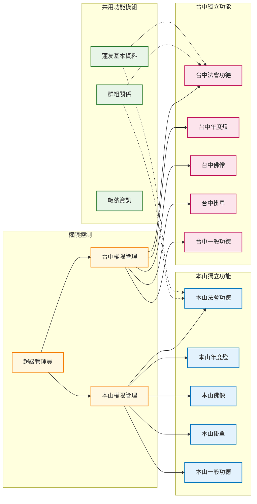

# 功德辦理系統 - 功能方塊圖

## 文件資訊

- **文件版本**: v1.0
- **建立日期**: 2025 年 07 月 04 日
- **文件類型**: 功能方塊圖
- **用途**: 展示系統功能模組階層關係和互動

## 系統功能方塊圖

### 整體功能架構

```mermaid
graph TB
    subgraph "使用者介面層"
        UI[Web應用介面]
        Mobile[行動應用介面]
        Print[列印介面]
    end

    subgraph "核心功能模組"
        subgraph "基本資料管理"
            Member[蓮友資料管理]
            Group[群組關係管理]
            Convert[皈依資訊管理]
        end

        subgraph "法會功德系統"
            Event[法會資料管理]
            Merit[功德項目管理]
            Register[報名繳費系統]
        end

        subgraph "特殊功德管理"
            Lamp[年度燈管理]
            Buddha[佛像管理]
            General[一般功德管理]
        end

        subgraph "掛單住宿系統"
            Room[寮房管理]
            Booking[床位登錄]
            Checkin[入住統計]
        end
    end

    subgraph "支援功能模組"
        subgraph "查詢功能"
            Search[綜合查詢]
            Report[報表查詢]
            Audit[檢核查詢]
        end

        subgraph "系統管理"
            Auth[權限管理]
            Log[系統紀錄]
            Tools[工具模組]
        end
    end

    subgraph "資料存取層"
        API[GraphQL API]
        Cache[快取層]
        Sync[資料同步]
    end

    subgraph "資料庫層"
        MainDB[(本山資料庫)]
        TaichungDB[(台中資料庫)]
        SharedDB[(共用資料庫)]
    end

    %% 連接關係
    UI --> Member
    UI --> Event
    UI --> Lamp
    UI --> Room
    UI --> Search
    UI --> Auth

    Mobile --> API
    Print --> Report

    Member --> API
    Group --> API
    Convert --> API
    Event --> API
    Merit --> API
    Register --> API
    Lamp --> API
    Buddha --> API
    General --> API
    Room --> API
    Booking --> API
    Checkin --> API
    Search --> API
    Report --> API
    Audit --> API
    Auth --> API
    Log --> API
    Tools --> API

    API --> Cache
    API --> Sync
    Cache --> MainDB
    Cache --> TaichungDB
    Sync --> SharedDB

    %% 樣式設定
    classDef coreModule fill:#e1f5fe,stroke:#01579b,stroke-width:2px
    classDef supportModule fill:#f3e5f5,stroke:#4a148c,stroke-width:2px
    classDef dataModule fill:#e8f5e8,stroke:#2e7d32,stroke-width:2px
    classDef uiModule fill:#fff3e0,stroke:#e65100,stroke-width:2px

    class Member,Group,Convert,Event,Merit,Register,Lamp,Buddha,General,Room,Booking,Checkin coreModule
    class Search,Report,Audit,Auth,Log,Tools supportModule
    class API,Cache,Sync,MainDB,TaichungDB,SharedDB dataModule
    class UI,Mobile,Print uiModule
```

### 本山/台中分院功能分配

### 核心功能模組詳細結構

```mermaid
graph TB
    subgraph "基本資料管理模組"
        A1[蓮友資料維護]
        A2[群組樹狀管理]
        A3[皈依資訊管理]
        A4[地址導航輔助]
        A5[重複資料檢核]
        A6[自訂字典管理]
    end

    subgraph "法會功德資料管理模組"
        B1[法會名稱設定]
        B2[功德項目建立]
        B3[牌位報表設定]
        B4[功德轉換功能]
        B5[歷史資料沿用]
        B6[自動續立功能]
    end

    subgraph "報名繳費系統模組"
        C1[功德報名處理]
        C2[繳費金額管理]
        C3[未繳費提醒]
        C4[沖帳功能]
        C5[到期查詢]
        C6[報表列印]
    end

    subgraph "年度燈管理模組"
        D1[點燈設定管理]
        D2[點燈報名]
        D3[燈牌列印]
        D4[續立管理]
    end

    subgraph "佛像管理模組"
        E1[佛像設定]
        E2[佛像報名]
        E3[報名管理]
    end

    subgraph "掛單系統模組"
        F1[寮房床位設定]
        F2[掛單登記]
        F3[入住統計]
        F4[名牌列印]
        F5[Excel匯入]
    end

    %% 模組間互動
    A1 --> C1
    A2 --> C1
    B1 --> C1
    B2 --> C1
    C1 --> C6
    C2 --> C4

    A1 --> D2
    D1 --> D2
    D2 --> D3

    A1 --> E2
    E1 --> E2

    A1 --> F2
    F1 --> F2
    F2 --> F3
    F3 --> F4

    %% 樣式設定
    classDef moduleA fill:#e8f5e8,stroke:#2e7d32,stroke-width:2px
    classDef moduleB fill:#e3f2fd,stroke:#0277bd,stroke-width:2px
    classDef moduleC fill:#fce4ec,stroke:#c2185b,stroke-width:2px
    classDef moduleD fill:#fff3e0,stroke:#e65100,stroke-width:2px
    classDef moduleE fill:#f3e5f5,stroke:#4a148c,stroke-width:2px
    classDef moduleF fill:#e0f2f1,stroke:#00695c,stroke-width:2px

    class A1,A2,A3,A4,A5,A6 moduleA
    class B1,B2,B3,B4,B5,B6 moduleB
    class C1,C2,C3,C4,C5,C6 moduleC
    class D1,D2,D3,D4 moduleD
    class E1,E2,E3 moduleE
    class F1,F2,F3,F4,F5 moduleF
```

### 支援功能模組詳細結構

```mermaid
graph TB
    subgraph "查詢功能模組"
        Q1[蓮友查詢]
        Q2[掛單查詢]
        Q3[到期查詢]
        Q4[收入查詢]
        Q5[法會查詢]
        Q6[繳費檢核]
        Q7[沖帳查詢]
    end

    subgraph "報表管理模組"
        R1[牌位批量列印]
        R2[入住證列印]
        R3[統計報表]
        R4[自訂報表]
    end

    subgraph "權限管理模組"
        P1[使用者管理]
        P2[角色權限設定]
        P3[本山台中權限]
        P4[操作日誌]
    end

    subgraph "系統紀錄模組"
        L1[刪除紀錄]
        L2[修改紀錄]
        L3[操作日誌]
        L4[登入紀錄]
    end

    subgraph "工具模組"
        T1[每日檢核]
        T2[法會檢核]
        T3[字典維護]
        T4[資料導入]
        T5[備份還原]
    end

    %% 模組間關聯
    Q1 --> R3
    Q2 --> R2
    Q3 --> R3
    Q4 --> R3
    Q5 --> R1

    P1 --> L4
    P2 --> L3
    P3 --> L3

    T1 --> L1
    T2 --> L1
    T4 --> L2

    %% 樣式設定
    classDef queryModule fill:#e8f5e8,stroke:#2e7d32,stroke-width:2px
    classDef reportModule fill:#e3f2fd,stroke:#0277bd,stroke-width:2px
    classDef authModule fill:#fff8e1,stroke:#f57c00,stroke-width:2px
    classDef logModule fill:#f3e5f5,stroke:#4a148c,stroke-width:2px
    classDef toolModule fill:#e0f2f1,stroke:#00695c,stroke-width:2px

    class Q1,Q2,Q3,Q4,Q5,Q6,Q7 queryModule
    class R1,R2,R3,R4 reportModule
    class P1,P2,P3,P4 authModule
    class L1,L2,L3,L4 logModule
    class T1,T2,T3,T4,T5 toolModule
```

## 功能模組說明

### 核心功能模組

#### 1. 基本資料管理模組

- **蓮友資料管理**: 姓名、地址、電話、性別等基本資料維護
- **群組關係管理**: 樹狀群組結構，支援關聯群組概念
- **皈依資訊管理**: 皈依、法名、受戒等宗教資訊
- **地址導航輔助**: 地址輸入精靈，提升資料準確性
- **重複資料檢核**: 自動檢查相同姓名/地址/電話
- **自訂字典管理**: 支援下拉選單和多重選擇備註

#### 2. 法會功德資料管理模組

- **法會名稱設定**: 法會建立、修改、範本管理
- **功德項目建立**: 功德項目、編號、金額設定
- **牌位報表設定**: 不同類型牌位報表格式
- **功德轉換功能**: 功德項目轉換，保留繳費紀錄
- **歷史資料沿用**: 自動帶入歷史報名資料
- **自動續立功能**: 到期功德自動續立

#### 3. 報名繳費系統模組

- **功德報名處理**: 新增、修改、刪除功德報名
- **繳費金額管理**: 已繳、未繳金額統計
- **未繳費提醒**: 超過預設金額上限提示
- **沖帳功能**: 需要二次驗證的沖帳操作
- **到期查詢**: 年度牌位、點燈到期提醒
- **報表列印**: 各種報名表單、繳費明細

#### 4. 年度燈管理模組

- **點燈設定管理**: 點燈名稱、金額、編號設定
- **點燈報名**: 報名、修改、樹狀顯示
- **燈牌列印**: 燈牌列印和列印紀錄
- **續立管理**: 歷史資料沿用和自動續立

#### 5. 佛像管理模組

- **佛像設定**: 佛像名稱、金額、編號設定
- **佛像報名**: 報名內容輸入和管理
- **報名管理**: 刪除、無效編號處理

#### 6. 掛單系統模組

- **寮房床位設定**: 寮房名稱、屬性、容量設定
- **掛單登記**: 掛單報名、床位分配
- **入住統計**: 每日人數統計、入住資料分析
- **名牌列印**: 個人/團體名牌列印
- **Excel 匯入**: 批量掛單名單匯入

### 支援功能模組

#### 1. 查詢功能模組

- **綜合查詢**: 蓮友、掛單、法會等各類查詢
- **報表查詢**: 收入、到期、繳費等統計查詢
- **檢核查詢**: 繳費檢核、沖帳查詢

#### 2. 報表管理模組

- **批量列印**: 牌位、入住證大批量列印
- **統計報表**: 各類統計分析報表
- **自訂報表**: 可自訂格式的報表功能

#### 3. 權限管理模組

- **使用者管理**: 本山/台中分院使用者管理
- **角色權限設定**: 細粒度權限控制
- **操作日誌**: 權限相關操作記錄

#### 4. 系統紀錄模組

- **操作紀錄**: 所有系統操作的完整記錄
- **刪除紀錄**: 基本資料、功德資料刪除記錄
- **修改追蹤**: 資料修改歷程追蹤

#### 5. 工具模組

- **檢核工具**: 每日報名檢核、法會報名檢核
- **字典維護**: 系統字典和選項維護
- **資料導入**: 朝山皈依資料等外部資料導入

## 系統特性

### 1. 本山/台中雙分院架構

- **資料共享**: 蓮友基本資料、群組關係共用
- **功能獨立**: 法會功德、掛單系統各自獨立
- **權限隔離**: 分院間資料存取權限控制

### 2. 複雜群組關係管理

- **樹狀結構**: 支援多層級群組關係
- **關聯群組**: 支援群組間的關聯關係
- **自動加入**: 相同地址/電話自動建議加入群組

### 3. 大量列印功能

- **批量處理**: 支援大批量牌位、入住證列印
- **格式多樣**: 支援不同類型報表格式
- **列印追蹤**: 列印狀態和歷程記錄

### 4. 多層級權限控制

- **角色權限**: 基於角色的權限管理
- **資料隔離**: 本山/台中資料存取控制
- **操作稽核**: 完整的操作日誌和追蹤

### 5. 歷史資料沿用和自動續立

- **資料沿用**: 歷史報名資料自動帶入
- **自動續立**: 到期功德自動續立功能
- **狀態管理**: 完整的功德狀態生命週期管理

---

_本功能方塊圖展示了功德辦理系統的完整功能架構，為系統開發和維護提供清晰的功能模組參考。_
