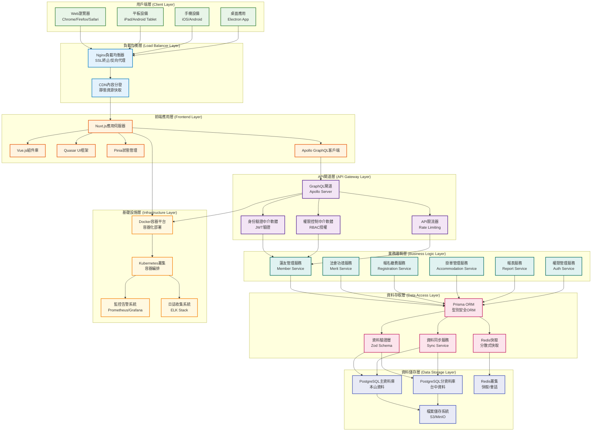
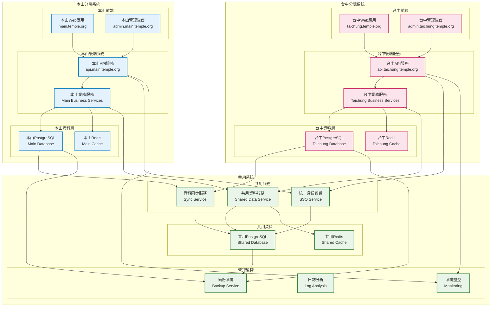
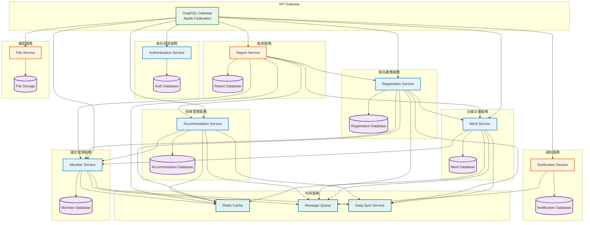
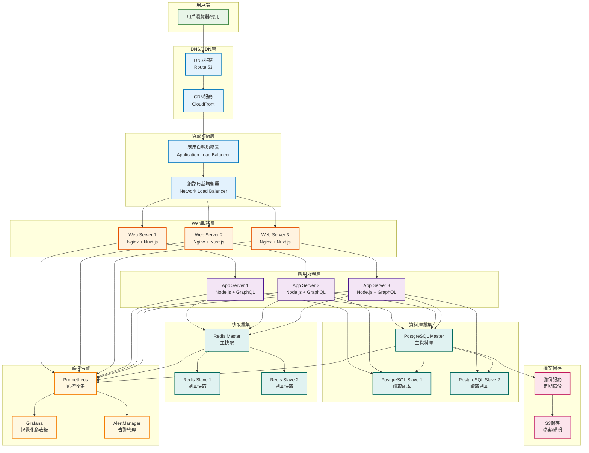
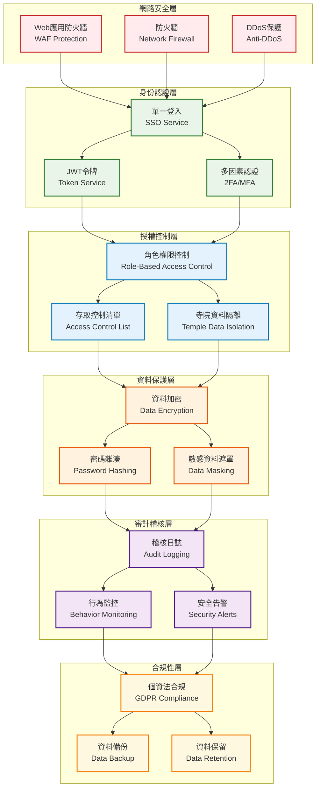
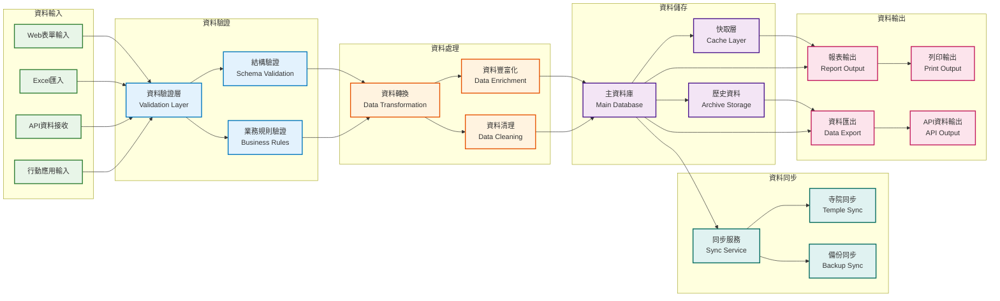

# 功德辦理系統 - 系統架構圖

## 文件資訊

- **文件版本**: v1.0
- **建立日期**: 2025 年 07 月 04 日
- **文件類型**: 系統架構圖
- **用途**: 展示系統技術架構和部署結構

## 整體系統架構

### 1. 分層架構設計



### 2. 本山/台中雙分院架構



### 3. 微服務架構設計



### 4. 部署架構設計



### 5. 安全架構設計



### 6. 資料流架構



## 技術架構詳細說明

### 1. 前端架構

#### 技術棧組合

- **框架**: Nuxt.js 3.8+ (Vue.js 3.x)
- **UI 庫**: Quasar Framework 2.14+
- **狀態管理**: Pinia 2.1+
- **GraphQL 客戶端**: Apollo Client 3.8+
- **型別檢查**: TypeScript 5.2+
- **構建工具**: Vite 4.5+

#### 組件架構

```typescript
// 組件層次結構
src/
├── components/          // 可重用組件
│   ├── common/         // 通用組件
│   ├── forms/          // 表單組件
│   ├── tables/         // 表格組件
│   └── charts/         // 圖表組件
├── pages/              // 頁面組件
├── layouts/            // 布局組件
├── composables/        // 組合式函數
├── stores/             // 狀態管理
├── graphql/            // GraphQL操作
└── utils/              // 工具函數
```

### 2. 後端架構

#### 技術棧組合

- **執行環境**: Node.js 18.18+ LTS
- **API 框架**: Apollo Server 4.9+ (GraphQL)
- **ORM**: Prisma 5.6+
- **身份認證**: JWT + bcrypt
- **資料驗證**: Zod 3.22+
- **快取**: Redis 7.2+

#### 服務架構

```typescript
// 服務層結構
src/
├── resolvers/          // GraphQL解析器
├── services/           // 業務邏輯服務
├── middleware/         // 中介軟體
├── schema/             // GraphQL結構定義
├── types/              // 型別定義
├── utils/              // 工具函數
└── config/             // 設定檔
```

### 3. 資料庫架構

#### 主要特點

- **主資料庫**: PostgreSQL 15+
- **快取系統**: Redis 7.2+ 叢集
- **備份策略**: 每日完整備份 + 即時增量備份
- **高可用性**: 主從複製 + 自動故障轉移
- **資料分區**: 按時間和寺院分區
- **安全性**: 行級安全策略 + 資料加密

#### 效能優化

- **索引策略**: 複合索引 + 部分索引
- **查詢優化**: 查詢計劃分析 + 慢查詢監控
- **連線池**: 連線池管理 + 連線複用
- **快取策略**: 查詢結果快取 + 應用層快取

### 4. 部署架構

#### 容器化部署

```dockerfile
# 多階段構建
FROM node:18-alpine AS builder
WORKDIR /app
COPY package*.json ./
RUN npm ci --only=production
COPY . .
RUN npm run build

FROM node:18-alpine AS runtime
WORKDIR /app
COPY --from=builder /app/dist ./dist
COPY --from=builder /app/node_modules ./node_modules
EXPOSE 3000
CMD ["npm", "start"]
```

#### Kubernetes 部署

```yaml
# 部署配置
apiVersion: apps/v1
kind: Deployment
metadata:
  name: merit-system
spec:
  replicas: 3
  selector:
    matchLabels:
      app: merit-system
  template:
    metadata:
      labels:
        app: merit-system
    spec:
      containers:
        - name: app
          image: merit-system:latest
          ports:
            - containerPort: 3000
          env:
            - name: DATABASE_URL
              valueFrom:
                secretKeyRef:
                  name: database-secret
                  key: url
```

### 5. 監控架構

#### 監控指標

- **應用效能**: 響應時間、吞吐量、錯誤率
- **系統資源**: CPU、記憶體、磁碟、網路
- **資料庫效能**: 查詢時間、連線數、鎖定狀態
- **業務指標**: 報名數量、繳費金額、使用者活躍度

#### 告警機制

- **即時告警**: 系統異常、效能閾值超標
- **定期報告**: 每日/週/月系統健康報告
- **通知方式**: 郵件、簡訊、即時通訊

### 6. 安全架構

#### 安全措施

- **網路安全**: WAF、防火牆、DDoS 防護
- **身份認證**: JWT、SSO、多因素認證
- **資料保護**: 加密傳輸、資料庫加密、敏感資料遮罩
- **存取控制**: RBAC、ACL、資料隔離
- **稽核追蹤**: 操作日誌、存取記錄、異常監控

#### 合規性

- **個資保護**: 符合個資法規範
- **資料保留**: 自動化資料保留政策
- **備份恢復**: 定期備份測試和恢復演練

## 擴展性設計

### 1. 水平擴展

- **負載均衡**: 多個應用實例
- **資料庫分片**: 按寺院和時間分片
- **快取分布**: Redis 叢集
- **CDN 加速**: 靜態資源分發

### 2. 垂直擴展

- **資源彈性**: 動態調整 CPU 和記憶體
- **儲存擴展**: 自動增加儲存容量
- **網路頻寬**: 按需調整頻寬

### 3. 微服務遷移

- **服務拆分**: 按功能域拆分服務
- **API 閘道**: 統一入口和路由
- **服務發現**: 自動服務註冊和發現
- **配置管理**: 集中化配置管理

## 災難恢復

### 1. 備份策略

- **資料備份**: 每日完整備份 + 即時增量備份
- **跨地域備份**: 多地域備份存儲
- **備份驗證**: 定期備份完整性檢查

### 2. 恢復流程

- **RTO 目標**: 4 小時內恢復服務
- **RPO 目標**: 資料損失不超過 1 小時
- **自動故障轉移**: 資料庫和服務自動切換
- **手動恢復**: 完整的災難恢復手冊

### 3. 高可用性

- **多可用區部署**: 跨可用區部署
- **服務冗餘**: 關鍵服務多實例部署
- **健康檢查**: 自動健康檢查和恢復

---

_本系統架構圖展示了功德辦理系統的完整技術架構，包含分層設計、微服務架構、部署策略、安全措施和擴展性設計等各個方面，為系統建設和維運提供全面的架構指引。_
