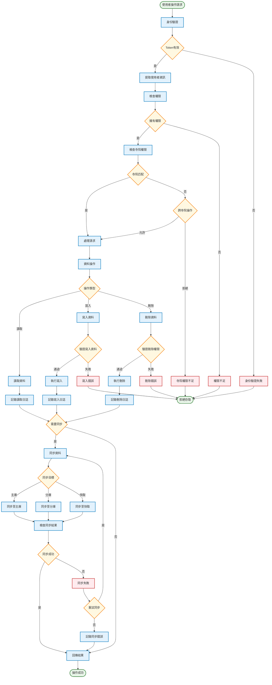
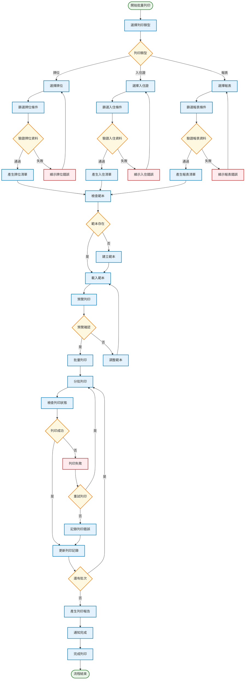
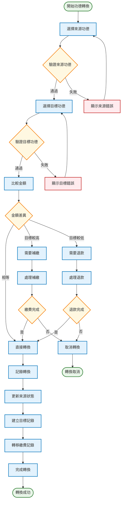
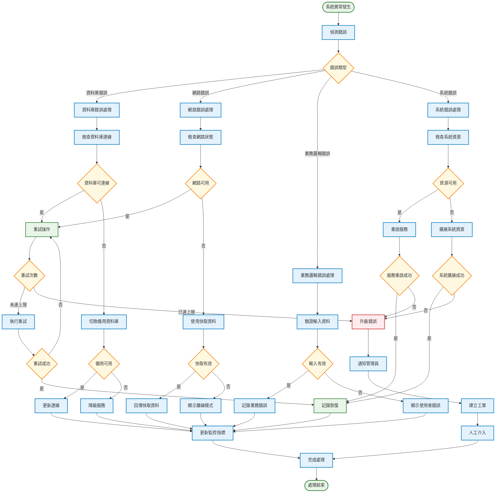

# 功德辦理系統 - 系統流程圖

## 文件資訊

- **文件版本**: v1.0
- **建立日期**: 2025 年 07 月 04 日
- **文件類型**: 系統流程圖
- **用途**: 展示系統核心業務流程和操作步驟

## 核心業務流程

### 1. 功德報名繳費完整流程

```mermaid
flowchart TD
    Start([開始功德報名]) --> Login{使用者登入}
    Login -->|成功| SelectTemple[選擇寺院<br/>本山/台中]
    Login -->|失敗| LoginError[登入失敗<br/>重新登入]
    LoginError --> Login

    SelectTemple --> SearchMember[搜尋蓮友資料]
    SearchMember --> MemberExists{蓮友是否存在}

    MemberExists -->|是| SelectMember[選擇蓮友]
    MemberExists -->|否| CreateMember[新增蓮友資料]

    CreateMember --> ValidateData{資料驗證}
    ValidateData -->|通過| CheckDuplicate[檢查重複資料]
    ValidateData -->|失敗| ShowError[顯示錯誤訊息]
    ShowError --> CreateMember

    CheckDuplicate --> SuggestGroup{建議加入群組}
    SuggestGroup -->|是| AddToGroup[加入群組]
    SuggestGroup -->|否| SaveMember[儲存蓮友資料]
    AddToGroup --> SaveMember

    SaveMember --> SelectMember
    SelectMember --> SelectEvent[選擇法會]
    SelectEvent --> SelectMerit[選擇功德項目]

    SelectMerit --> InputDetails[輸入功德詳情]
    InputDetails --> CheckHistory{是否使用歷史資料}
    CheckHistory -->|是| LoadHistory[載入歷史資料]
    CheckHistory -->|否| InputManual[手動輸入]

    LoadHistory --> InputManual
    InputManual --> ValidateMerit{驗證功德資料}
    ValidateMerit -->|通過| CalculateAmount[計算金額]
    ValidateMerit -->|失敗| ShowMeritError[顯示錯誤]
    ShowMeritError --> InputManual

    CalculateAmount --> CheckLimit{檢查金額上限}
    CheckLimit -->|超過| ShowWarning[顯示警告訊息]
    CheckLimit -->|正常| SaveRegistration[儲存報名資料]
    ShowWarning --> ConfirmAmount{確認繼續}
    ConfirmAmount -->|是| SaveRegistration
    ConfirmAmount -->|否| InputManual

    SaveRegistration --> ProcessPayment[處理繳費]
    ProcessPayment --> PaymentMethod{繳費方式}

    PaymentMethod -->|現金| RecordCash[記錄現金收入]
    PaymentMethod -->|轉帳| RecordTransfer[記錄轉帳]
    PaymentMethod -->|延後繳費| RecordPending[記錄待繳費]

    RecordCash --> UpdateBalance[更新繳費餘額]
    RecordTransfer --> UpdateBalance
    RecordPending --> UpdateBalance

    UpdateBalance --> PrintReceipt{列印收據}
    PrintReceipt -->|是| GenerateReceipt[產生收據]
    PrintReceipt -->|否| LogTransaction[記錄交易]
    GenerateReceipt --> LogTransaction

    LogTransaction --> AutoRenew{自動續立}
    AutoRenew -->|是| SetupRenewal[設定續立]
    AutoRenew -->|否| Complete[完成報名]
    SetupRenewal --> Complete

    Complete --> End([流程結束])

    %% 樣式設定
    classDef startEnd fill:#e8f5e8,stroke:#2e7d32,stroke-width:2px
    classDef process fill:#e3f2fd,stroke:#0277bd,stroke-width:2px
    classDef decision fill:#fff8e1,stroke:#f57c00,stroke-width:2px
    classDef error fill:#ffebee,stroke:#c62828,stroke-width:2px

    class Start,End startEnd
    class SelectTemple,SearchMember,SelectMember,CreateMember,SelectEvent,SelectMerit,InputDetails,LoadHistory,InputManual,CalculateAmount,SaveRegistration,ProcessPayment,RecordCash,RecordTransfer,RecordPending,UpdateBalance,GenerateReceipt,LogTransaction,SetupRenewal,Complete,CheckDuplicate,AddToGroup,SaveMember process
    class Login,MemberExists,ValidateData,SuggestGroup,CheckHistory,ValidateMerit,CheckLimit,ConfirmAmount,PaymentMethod,PrintReceipt,AutoRenew decision
    class LoginError,ShowError,ShowMeritError,ShowWarning error
```

### 2. 掛單系統完整流程

```mermaid
flowchart TD
    Start([開始掛單登記]) --> SelectEvent[選擇法會]
    SelectEvent --> CheckRooms[檢查寮房狀態]
    CheckRooms --> SearchGuest[搜尋蓮友]

    SearchGuest --> GuestExists{蓮友是否存在}
    GuestExists -->|是| SelectGuest[選擇蓮友]
    GuestExists -->|否| CreateGuest[新增蓮友]

    CreateGuest --> ValidateGuest{驗證蓮友資料}
    ValidateGuest -->|通過| SaveGuest[儲存蓮友資料]
    ValidateGuest -->|失敗| ShowError[顯示錯誤]
    ShowError --> CreateGuest

    SaveGuest --> SelectGuest
    SelectGuest --> CheckEligibility[檢查入住資格]
    CheckEligibility --> EligibilityCheck{資格檢查}
    EligibilityCheck -->|通過| SelectRoom[選擇寮房]
    EligibilityCheck -->|不通過| ShowIneligible[顯示不符資格]
    ShowIneligible --> SelectGuest

    SelectRoom --> CheckAvailability[檢查床位可用性]
    CheckAvailability --> RoomAvailable{床位是否可用}
    RoomAvailable -->|是| SelectBed[選擇床位]
    RoomAvailable -->|否| ShowFull[顯示滿床]
    ShowFull --> SelectRoom

    SelectBed --> CheckRestrictions[檢查床位限制]
    CheckRestrictions --> RestrictionCheck{限制檢查}
    RestrictionCheck -->|通過| InputBookingDetails[輸入掛單詳情]
    RestrictionCheck -->|不通過| ShowRestriction[顯示限制說明]
    ShowRestriction --> SelectBed

    InputBookingDetails --> SetDates[設定入住日期]
    SetDates --> ValidateDates{驗證日期}
    ValidateDates -->|通過| SaveBooking[儲存掛單資料]
    ValidateDates -->|失敗| ShowDateError[顯示日期錯誤]
    ShowDateError --> SetDates

    SaveBooking --> UpdateOccupancy[更新床位占用]
    UpdateOccupancy --> PrintNameTag{列印名牌}
    PrintNameTag -->|是| GenerateNameTag[產生名牌]
    PrintNameTag -->|否| LogBooking[記錄掛單]
    GenerateNameTag --> LogBooking

    LogBooking --> NotifySuccess[通知成功]
    NotifySuccess --> BatchProcess{批量處理}
    BatchProcess -->|是| ProcessNext[處理下一筆]
    BatchProcess -->|否| Complete[完成掛單]
    ProcessNext --> SearchGuest

    Complete --> End([流程結束])

    %% 樣式設定
    classDef startEnd fill:#e8f5e8,stroke:#2e7d32,stroke-width:2px
    classDef process fill:#e3f2fd,stroke:#0277bd,stroke-width:2px
    classDef decision fill:#fff8e1,stroke:#f57c00,stroke-width:2px
    classDef error fill:#ffebee,stroke:#c62828,stroke-width:2px

    class Start,End startEnd
    class SelectEvent,CheckRooms,SearchGuest,SelectGuest,CreateGuest,SaveGuest,CheckEligibility,SelectRoom,CheckAvailability,SelectBed,CheckRestrictions,InputBookingDetails,SetDates,SaveBooking,UpdateOccupancy,GenerateNameTag,LogBooking,NotifySuccess,ProcessNext,Complete process
    class GuestExists,ValidateGuest,EligibilityCheck,RoomAvailable,RestrictionCheck,ValidateDates,PrintNameTag,BatchProcess decision
    class ShowError,ShowIneligible,ShowFull,ShowRestriction,ShowDateError error
```

### 3. 法會功德設定流程

```mermaid
flowchart TD
    Start([開始法會設定]) --> CreateEvent[建立法會]
    CreateEvent --> InputEventDetails[輸入法會資訊]
    InputEventDetails --> ValidateEvent{驗證法會資料}
    ValidateEvent -->|通過| SaveEvent[儲存法會資料]
    ValidateEvent -->|失敗| ShowEventError[顯示錯誤]
    ShowEventError --> InputEventDetails

    SaveEvent --> UseTemplate{使用範本}
    UseTemplate -->|是| SelectTemplate[選擇範本]
    UseTemplate -->|否| CreateMeritItems[建立功德項目]

    SelectTemplate --> LoadTemplate[載入範本]
    LoadTemplate --> CreateMeritItems

    CreateMeritItems --> InputMeritDetails[輸入功德詳情]
    InputMeritDetails --> ValidateMerit{驗證功德項目}
    ValidateMerit -->|通過| SaveMeritItem[儲存功德項目]
    ValidateMerit -->|失敗| ShowMeritError[顯示錯誤]
    ShowMeritError --> InputMeritDetails

    SaveMeritItem --> SetReportFormat[設定報表格式]
    SetReportFormat --> ConfigureMemorial[設定牌位格式]
    ConfigureMemorial --> ConfigureLamp[設定點燈格式]
    ConfigureLamp --> ConfigureOffering[設定供齋格式]

    ConfigureOffering --> PreviewReport[預覽報表]
    PreviewReport --> ReportOK{報表確認}
    ReportOK -->|是| SaveConfiguration[儲存設定]
    ReportOK -->|否| SetReportFormat

    SaveConfiguration --> SetupRooms[設定寮房]
    SetupRooms --> ConfigureRooms[設定寮房屬性]
    ConfigureRooms --> TestPrint[測試列印]
    TestPrint --> PrintOK{列印測試}
    PrintOK -->|是| ActivateEvent[啟用法會]
    PrintOK -->|否| SetReportFormat

    ActivateEvent --> NotifyUsers[通知使用者]
    NotifyUsers --> Complete[完成設定]
    Complete --> End([流程結束])

    %% 樣式設定
    classDef startEnd fill:#e8f5e8,stroke:#2e7d32,stroke-width:2px
    classDef process fill:#e3f2fd,stroke:#0277bd,stroke-width:2px
    classDef decision fill:#fff8e1,stroke:#f57c00,stroke-width:2px
    classDef error fill:#ffebee,stroke:#c62828,stroke-width:2px

    class Start,End startEnd
    class CreateEvent,InputEventDetails,SaveEvent,SelectTemplate,LoadTemplate,CreateMeritItems,InputMeritDetails,SaveMeritItem,SetReportFormat,ConfigureMemorial,ConfigureLamp,ConfigureOffering,PreviewReport,SaveConfiguration,SetupRooms,ConfigureRooms,TestPrint,ActivateEvent,NotifyUsers,Complete process
    class ValidateEvent,UseTemplate,ValidateMerit,ReportOK,PrintOK decision
    class ShowEventError,ShowMeritError error
```

### 4. 權限驗證和資料同步流程

### 5. 批量列印處理流程

## 特殊業務流程

### 1. 功德轉換流程

### 2. 自動續立功能流程

```mermaid
flowchart TD
    Start([系統定時檢查]) --> CheckSchedule[檢查續立排程]
    CheckSchedule --> ScanExpiring[掃描到期功德]
    ScanExpiring --> HasExpiring{有到期功德}
    HasExpiring -->|是| ProcessExpiring[處理到期功德]
    HasExpiring -->|否| ScheduleNext[排程下次檢查]
    ScheduleNext --> End([檢查結束])

    ProcessExpiring --> LoadExpiring[載入到期清單]
    LoadExpiring --> CheckRenewal[檢查續立設定]
    CheckRenewal --> AutoRenew{自動續立}
    AutoRenew -->|是| CreateRenewal[建立續立記錄]
    AutoRenew -->|否| SendNotice[發送到期通知]

    CreateRenewal --> CopyData[複製原始資料]
    CopyData --> UpdateAmount[更新金額]
    UpdateAmount --> SetNewPeriod[設定新期間]
    SetNewPeriod --> ValidateRenewal{驗證續立資料}
    ValidateRenewal -->|通過| SaveRenewal[儲存續立記錄]
    ValidateRenewal -->|失敗| LogRenewalError[記錄續立錯誤]
    LogRenewalError --> SendNotice

    SaveRenewal --> UpdateOriginal[更新原始記錄]
    UpdateOriginal --> ProcessPayment[處理續立繳費]
    ProcessPayment --> PaymentMethod{繳費方式}
    PaymentMethod -->|預付| DeductPrepaid[扣除預付金]
    PaymentMethod -->|待繳| CreatePending[建立待繳記錄]
    PaymentMethod -->|自動扣款| ProcessAuto[處理自動扣款]

    DeductPrepaid --> UpdateBalance[更新餘額]
    CreatePending --> SendPaymentNotice[發送繳費通知]
    ProcessAuto --> AutoPayment{自動扣款成功}
    AutoPayment -->|是| UpdateBalance
    AutoPayment -->|否| CreatePending

    UpdateBalance --> LogRenewal[記錄續立日誌]
    SendPaymentNotice --> LogRenewal
    SendNotice --> LogNotice[記錄通知日誌]

    LogRenewal --> MoreExpiring{還有到期項目}
    LogNotice --> MoreExpiring
    MoreExpiring -->|是| ProcessExpiring
    MoreExpiring -->|否| GenerateReport[產生續立報告]

    GenerateReport --> NotifyAdmin[通知管理員]
    NotifyAdmin --> Complete[完成處理]
    Complete --> End

    %% 樣式設定
    classDef startEnd fill:#e8f5e8,stroke:#2e7d32,stroke-width:2px
    classDef process fill:#e3f2fd,stroke:#0277bd,stroke-width:2px
    classDef decision fill:#fff8e1,stroke:#f57c00,stroke-width:2px
    classDef error fill:#ffebee,stroke:#c62828,stroke-width:2px

    class Start,End startEnd
    class CheckSchedule,ScanExpiring,ProcessExpiring,LoadExpiring,CheckRenewal,CreateRenewal,SendNotice,CopyData,UpdateAmount,SetNewPeriod,SaveRenewal,UpdateOriginal,ProcessPayment,DeductPrepaid,CreatePending,ProcessAuto,UpdateBalance,SendPaymentNotice,LogRenewal,LogNotice,GenerateReport,NotifyAdmin,Complete,ScheduleNext,LogRenewalError process
    class HasExpiring,AutoRenew,ValidateRenewal,PaymentMethod,AutoPayment,MoreExpiring decision
    class LogRenewalError error
```

## 系統異常處理流程

### 1. 錯誤處理和恢復流程

## 流程說明

### 核心業務流程特點

1. **功德報名繳費流程**

   - 完整的使用者驗證和權限檢查
   - 自動檢查重複資料和建議群組
   - 支援歷史資料載入和自動續立
   - 多種繳費方式處理

2. **掛單系統流程**

   - 寮房可用性即時檢查
   - 入住資格和限制驗證
   - 支援批量處理和名牌列印
   - 床位占用狀態自動更新

3. **法會功德設定流程**

   - 範本化設定提升效率
   - 報表格式預覽和測試
   - 整合寮房和列印設定
   - 完整的設定驗證機制

4. **權限驗證和資料同步**

   - 多層級權限驗證
   - 跨寺院操作控制
   - 自動資料同步機制
   - 完整的操作日誌記錄

5. **批量列印處理**
   - 支援多種列印類型
   - 分批處理提升效能
   - 範本化列印格式
   - 列印狀態追蹤

### 特殊功能流程

1. **功德轉換流程**

   - 金額差異自動處理
   - 補繳和退款機制
   - 完整的轉換記錄追蹤

2. **自動續立功能**

   - 定時檢查到期功德
   - 自動建立續立記錄
   - 多種繳費方式支援
   - 通知和報告機制

3. **錯誤處理和恢復**
   - 多層級錯誤處理
   - 自動恢復機制
   - 備用系統切換
   - 完整的監控和告警

---

_本系統流程圖展示了功德辦理系統的核心業務流程，為系統開發和操作提供詳細的流程指引。_
